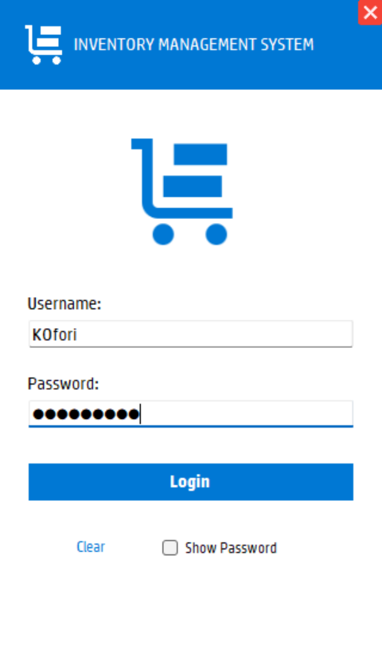
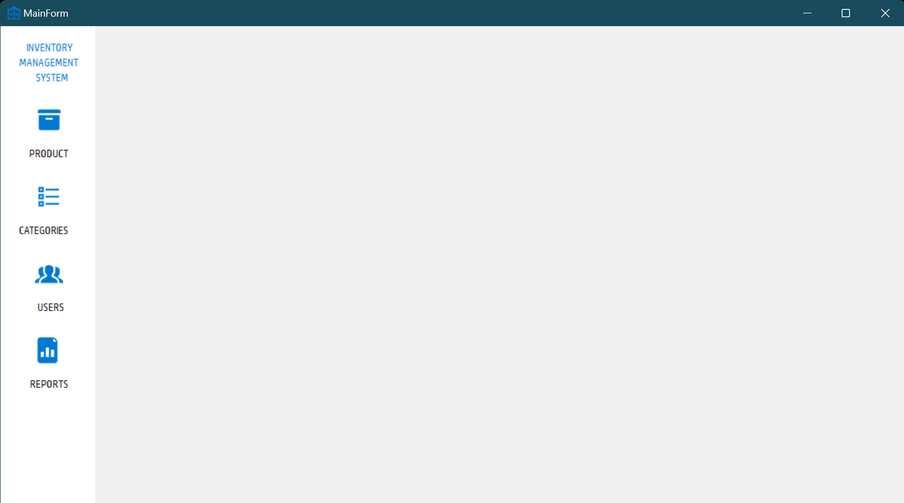
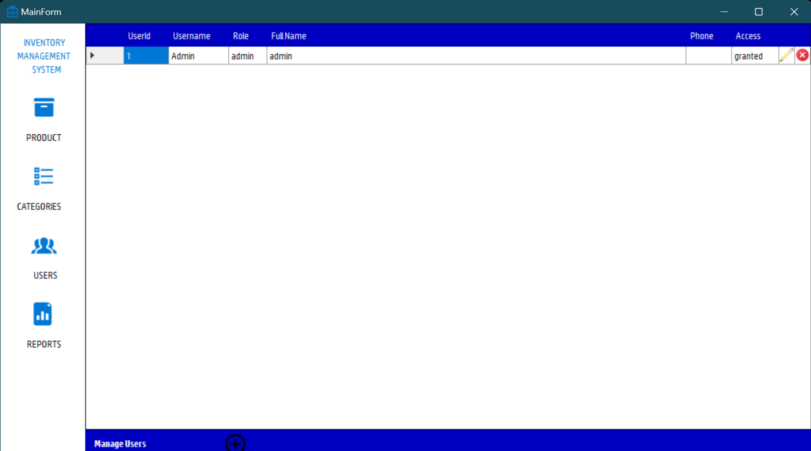
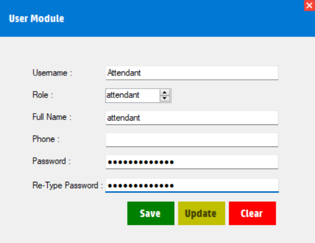
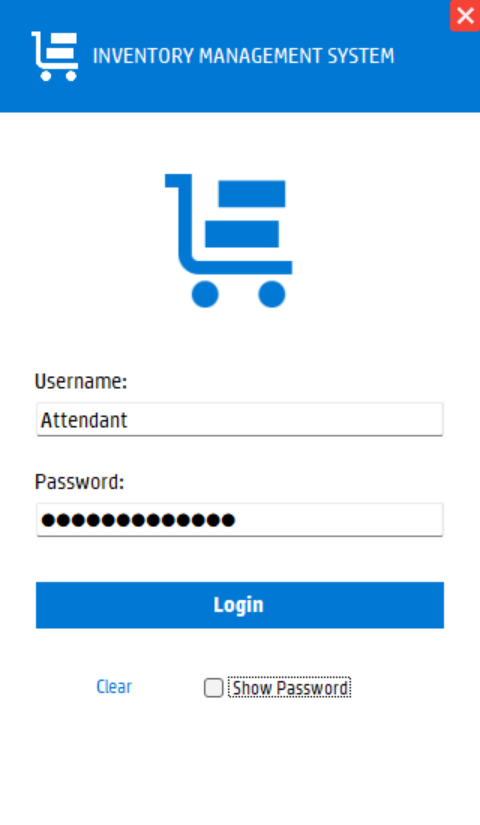
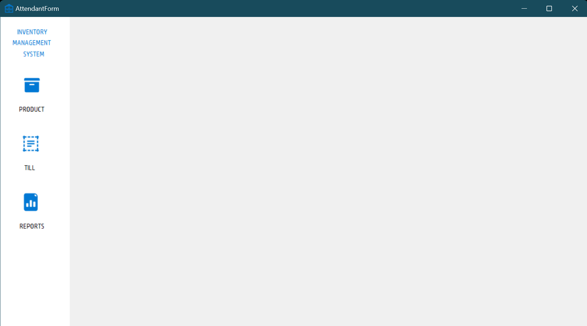

<!-- PROJECT LOGO -->
<br />
<div align="center">
  <a href="https://github.com/KOEdoo/Programming-II-IA">
    
  </a>

  <h2 align="center">Programming II IA README</h2>

  <p align="center">
    An Inventory Management System  
  </p>
</div>

<!-- TABLE OF CONTENTS -->
<details>
  <summary>Table of Contents</summary>
  <ol>
    <li>
      <a href="#about-the-project">About The Project</a>
      <ul>
        <li><a href="#assignment-question">Assignment Question</a></li>
        <li><a href="#built-with">Built With</a></li>
        <li><a href="#assumptions">Some Assumptions</a></li>
      </ul>
    </li>
    <li>
      <a href="#getting-started">Getting Started</a>
      <ul>
        <li><a href="#prerequisites">Prerequisites</a></li>
        <li><a href="#setting-up">Setting Up</a></li>
      </ul>
    </li>
    <li><a href="#usage">Usage</a></li>
    <li><a href="#demo">Demo</a></li>
    <li><a href="#contact">Contact</a></li>
  </ol>
</details>

<!-- ABOUT THE PROJECT -->

## About The Project

For our Interim Assessment we were tasked with creating an inventory management system to meet certain requirements.

<!-- ASSIGNMENT QUESTION  -->

### Assignment Question

You have been hired as a software engineer to develop an inventory management system for Shoprite Ghana Limited. As part of the software development cycle the following requirements were captured and documented as functional and non-functional requirements

- An admin should be able to manage product categories
- An admin should be able to manage products
- An admin should be able to set a reorder level for each product
- An admin should be able to manage stock
- An admin should be able to create and manage other users
- An admin should be able to reset password for other users
- An attendant should be able to open and start a till(sales)
- An attendant should be able to perform sales transaction, a typical sale involve;
  - Scanning of barcode of product
  - Recording of transaction with transaction detail
  - Maintaining appropriate ledger on stock levels
  - Generating sales receipt
- An attendant should be able to close till(sales) for the day
- Attendant should be able to generate sales report for daily transactions
- Admin should be able generate sales report
- All parties should be able to login with username and hashed passwords
- Impress me

Add a readme to your submission explaining all assumptions made and how your application works including a link to a Youtube video demonstrating your solution. (Video Length 5mins max)

### Built With

This project was developed using;

- 
- 

### Some Assumptions

- Barcode scan to identify product replaced with search product box by barcode
- Print receipt replaced with message box showing purchase detail

<!-- GETTING STARTED -->

## Getting Started

### Prerequisites

- Visual Studio 2022
- Microsoft SQL Server 2019

### Setting Up

> This is assuming you have Visual Studio 2022 and Microsoft SQL Server
> 2019 installed on the device intended to run this application locally

- Setup Database
  - Open sql server command line client
    ```sh
    sqlcmd
    ```
  - Run content of setup.sql file
    > All .sql files are found in the sql directory
- Open source code in Visual Studio
  - Tools > Connect to Database (database name LearningDb2)
  - Copy connection string
  - In App.config edit
    ```sh
    <add
    name="InventorySystem.Properties.Settings.LearningDb2ConnectionString"
            connectionString="INSERT CONNECTION STRING HERE"
            providerName="System.Data.SqlClient" />
    ```
- Start application

<!-- USAGE EXAMPLES -->

## Usage

> Prior to use one may chose to insert mock products into the database.
> This can be acheived by running content mockData.sql in sql command line client

- Workflow for adding new attendant user

<div align="center">
<h4>Login Page</h4>

</div>
<p>If this is the first time running the application this default admin user will be created <br>username: Admin <br> password: admin1122 <br></p>

<div align="center">
<h4>Admin Main Page </h4>


<h4>User Page </h4>


<h4>Create New Attendant User</h4>


<h4>Attendant Login</h4>


<h4>Attendant Main Page </h4>

</div>

<!-- DEMO -->

## Demo

[Click this link to view Demo Video](https://example.com)

<!-- CONTACT -->

## Contact

Kofi Ofori Edoo - [@k_edoo\_](https://twitter.com/k_edoo_) - koedoo@st.ug.edu.gh

Project Link: [https://github.com/KOEdoo/Programming-II-IA](https://github.com/KOEdoo/Programming-II-IA)

<p align="right">(<a href="#readme-top">Back to top</a>)</p>
